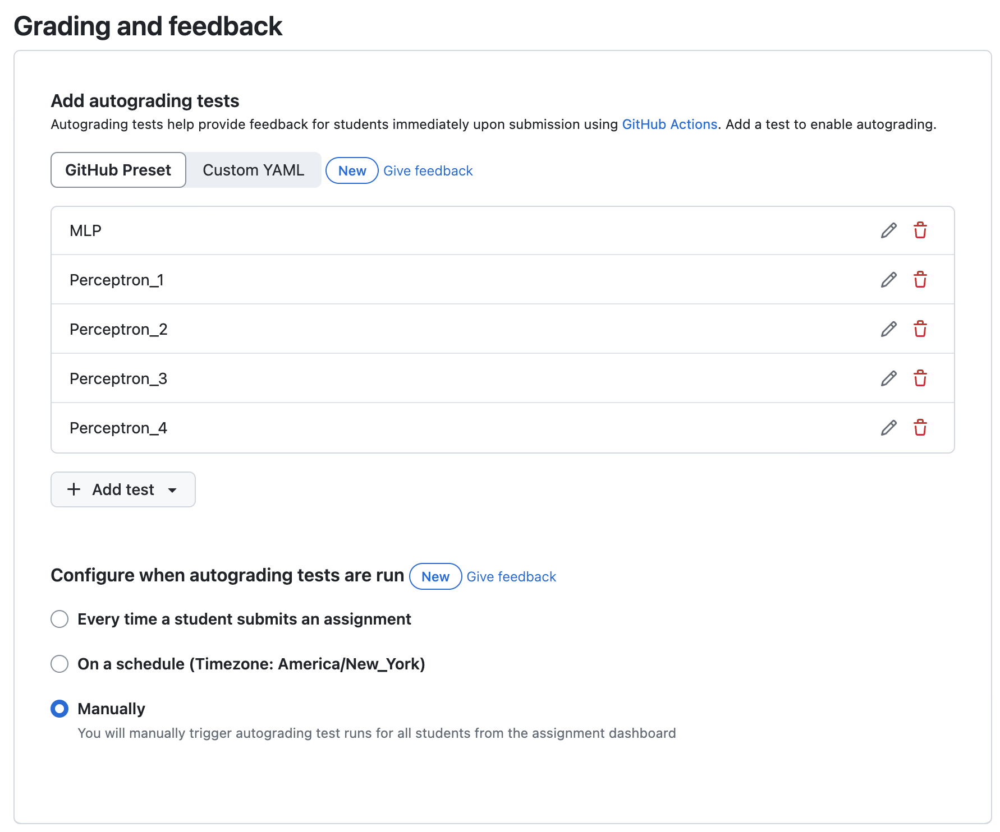
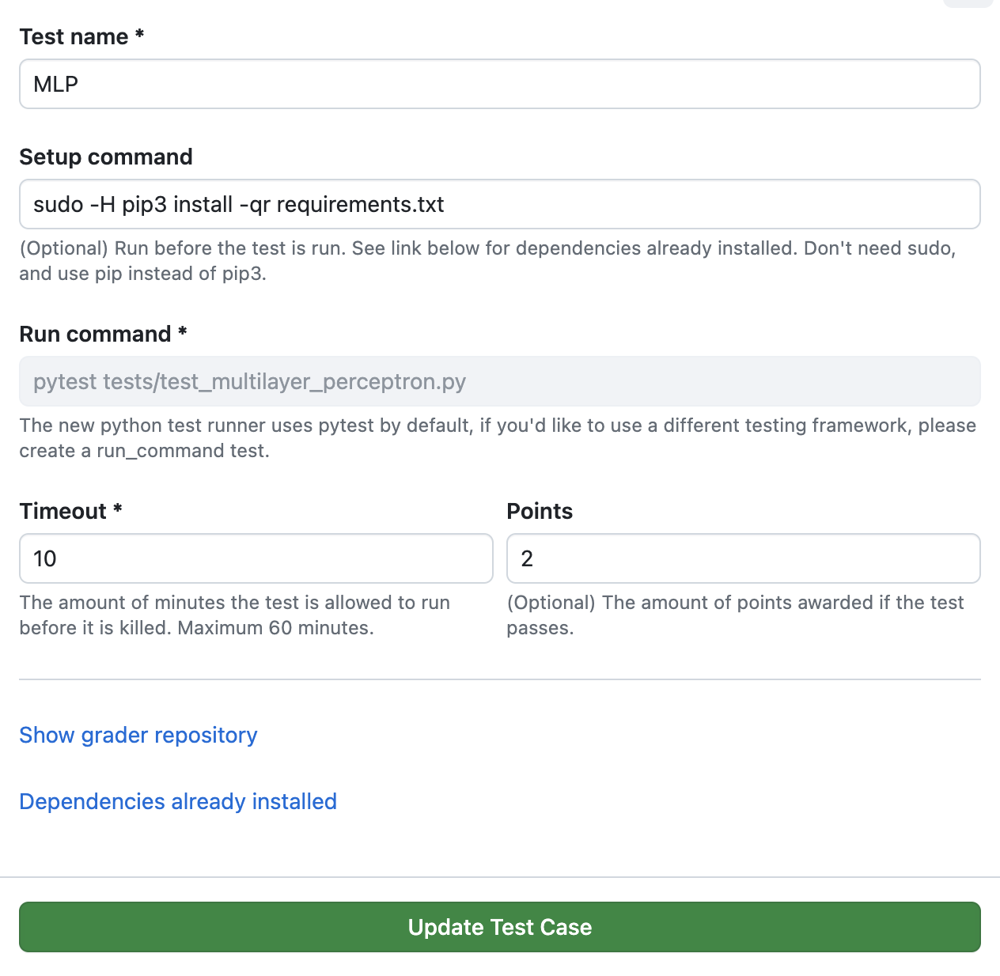

# Setting up autograding in GitHub Classroom

This file explains how to configure autograding for assignments in GitHub Classroom using a template repository.

You can also check Github's [official guide](https://docs.github.com/en/education/manage-coursework-with-github-classroom/teach-with-github-classroom/use-autograding) for more info.

## Prerequisites

- Access to GitHub Classroom as a TA
- A template repository containing the starter code of the assignment, and in the starter code repo, a subfolder tests containing the tests that will be run for autograding (one example of template repo, [5740-A1 in 2024](https://github.com/cornell-cs5740-sp24/Assignment-1))

## Steps

1. Create a template repository, under cornell-cs5740-xxxx (semester)
   - Create a new repository on GitHub
   - Add the files of the starter repo (better to have a dummy result file for testing the leaderboard later)
   - Include test files for autograding
   - Click "Settings" > ✅ "Template repository"

2. Set up the assignment in GitHub Classroom
   - Go to your [GitHub Classroom](https://classroom.github.com/classrooms)
   - (If the assignment has not been created yet) Click "New assignment"
   - Choose "Individual assignment"
   - In "Assignment basics", fill in the assignment details (example: `CS5740 Sp24 Assignment 1` for the `Assignment title`, deadline, if it's an individual assignment)
   - In "Starter code and environment", under "Add a template repository to give students starter code", select your template repository. The repo visibility is "Private".
   - No need to add a support editor unless there's a particular reason
   - Please update the assignment init link in the assignment Latex

3. Set up autograding in "Grading and feedback"
   - Scroll to "Add autograding tests"
   - Click "Add test"
   - Choose your test type (e.g., input/output, unit test)
   - Configure the test settings
   - Add more tests as needed

Examples for A1, 2024:

Autograding tests:

Detailed test setup for MLP:

4. Complete assignment creation
   - Review your settings
   - Click "Create assignment"
