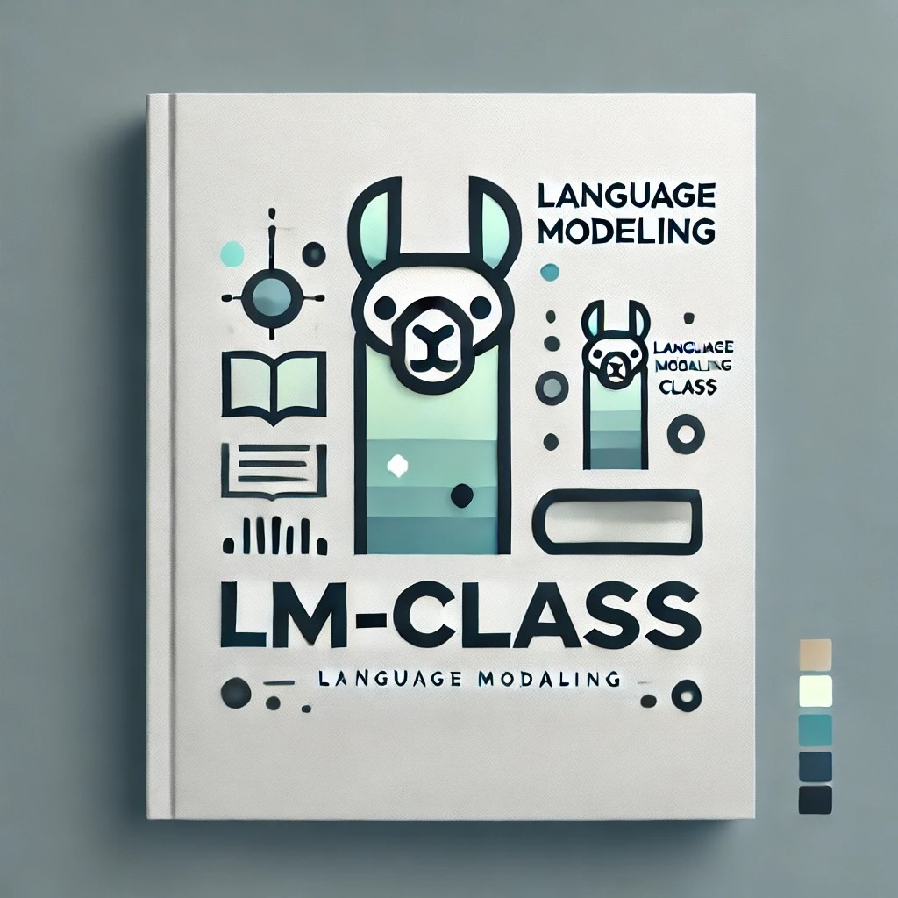

---
# Feel free to add content and custom Front Matter to this file.
# To modify the layout, see https://jekyllrb.com/docs/themes/#overriding-theme-defaults

layout: page
title: LM-class
order: 0
---

<strong><small>Version: 2024.1beta</small></strong>

  

    
LM-class is an introduction-level education resource for contemporary language modeling, broadly construed. It relies on prior understanding of machine learning and neural networks at the introduction level, as well as undergraduate-level programming, probability theory, and linear algebra. The target audience of the class is MEng/MS graduate students. The material is likely also appropriate for senior undergraduates. While the technical material is a good fit for PhDs and researchers, this class does not focus on research, and is designed primarily for practitioners.

    
The materials include <a href="/lectures">lectures</a> and <a href="/assignments">assignments</a>. The class emphasizes technical depth rather than coverage. It does not aim to provide a broad overview of everything that is happening in the field. The objective is to give students a strong base and the tools to expand their knowledge and update it on their own.

    
The materials were developed for Cornell Tech's CS 5740 Natural Language Processing, and were first used in <a href="https://courses.cs.cornell.edu/cs5740/2024sp/">Spring 2024</a>. This class constituted a significant revision of CS 5740. LM-class was created by <a href="https://yoavartzi.com/">Yoav Artzi</a>, <a href="https://annshin.github.io/">Anne Wu</a>, and <a href="https://momergul.github.io/">Omer Gul</a>. Much of the material was adapted or inspired by existing NLP classes. Each lecture and assignment includes a slide at the end with acknowledgements. If I missed any attribution, I am really sorry. Please let me know, so I can correct. Acknowledgements are listed <a href="#acknowledgements">below</a>.

    
The materials are distributed under the <a href="https://creativecommons.org/licenses/by-nc/4.0/">CC BY-NC 4.0</a> license, and we hope they will find broad and diverse use.

  

  

    
  

## Issues and Future Plans

LM-class is very much work in progress, with a lot of TODOs. I am maintaining <a href="https://docs.google.com/document/d/1aAYaRvR1BauC4RS5TzCeM4fCbTbnPwQVcjlMAVMlTjU/edit#heading=h.cdynfr8juu90">a document with issues that I am considering to modify or fix</a>, and plan to revisit many of them in the next revision. Feel free to leave comments there.

There are several topics not covered by the current version of the lectures, and that are on the planning board to potentially be added in the future:

1. Mixture of experts (MoE)
2. Approximate fine tuning and inference (e.g., LoRA, QLoRA)
3. State space models (SSMs)
4. RNNs and CNNs
5. Arena-style LLM evaluation

I am also considering adding a PyTorch tutorial, with focus on:

1. Setting up experiments
2. Handling data
3. Conducting parameter sweeps
4. Basic debugging techniques

## Beyond LM-class

LM-class is a considerable revamp of how I teach language modeling and NLP. I am still trying to figure out how it integrates into a broader curriculum, beyond the prerequisites listed above. Currently, the most attractive next step in the sequence where LM-class is the first step is [Stanford's CS 336 Language Modeling from Scratch](https://stanford-cs336.github.io/), which was designed by [Tatsunori Hashimoto](https://thashim.github.io/) and [Percy Liang](https://cs.stanford.edu/~pliang/). CS 336 offers an advanced deep technical dive into training a contemporary language model from scratch.

## Acknowledgements

This resource could not have been created if not for the amazing breadth and richness of teaching material that has been made publicly available by members of the community.
LM-class includes material that is adapted from or heavily inspired by material created over the years by (in no particular order) Dan Klein, Alane Suhr, Greg Durrett, Luke Zettlemoyer, Mike Collins, Mohit Iyyer, Ana Marasović, Sewon Min, Chris Manning, Dan Jurafsky, Tatsunori Hashimoto, Chris Dyer, Yoav Goldberg, Graham Neubig, Lucas Bayer, Daphne Ippolito, Chenyan Xiong, and Eric Mitchell.
More specific acknowledgements are given in each slide deck.
I would like to extend special thanks to Jason Eisner for creating a community to discuss NLP teaching. Many thanks to Greg Durrett, Mohit Iyyer, Ana Marasović, Christian von der Weth, Nanyun (Violet) Peng, David Jurgens and man others for very helpful discussions.
